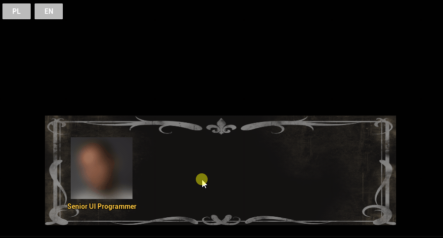

# Monkey Island Style Dialogue System



## Project Overview

RUN IN STANDALONE TO ENSURE PROPER LANGUAGE CHANGING

This project implements a Monkey Island-style dialogue system using Unreal Engine 5.5 and UMG widgets. It features:

- A custom dialogue widget that displays:
  - The speaking character's portrait
  - The character's name
  - The dialogue text
- A typewriter effect where text appears letter-by-letter
- The ability to skip the effect with the spacebar or LMB
- A scrollable text box for longer dialogue
- Multiple speakers with only one widget visible at a time
- Black background focus for an immersive dialogue experience

  

## Features

### Core Features

- **Custom Dialogue Widget** → Displays speaker's portrait, name, and dialogue text
- **Typewriter Effect** → Text appears dynamically, simulating a writing effect
- **Skip Option** → Spacebar fills in text instantly
- **Multiple Characters Support** → Dialogue swaps between different speakers
- **Scrollable Text Box** → Handles long dialogue texts properly
- **Black Screen Mode** → Background is kept black for UI focus

### Stretch Goals Implemented

- **Keyword Highlighting & Tooltips** → Special words are color-coded and show tooltips on hover (Wikipedia-style)
- **Localization-Friendly Implementation** → All text uses `FText` for easy translation

## Technical Implementation

### Dialogue System

- Built with C++ and Blueprints, combining performance & flexibility
- Uses `URichTextBlock` for advanced text formatting
- Implements `FTimerHandle` for smooth typewriter animation

### UI/UMG Elements

- `WBP_DialogueWidget` → Main dialogue UI
- `URichTextBlock` → Supports text highlighting & tooltips
- `ScrollBox` → Handles text overflow properly

## Installation & Setup

### Prerequisites

- Unreal Engine 5.5
- Windows 10/11

### Setup Instructions

1. Clone the Repository:

   ```bash
   git clone https://github.com/ZimaXXX/UIDialogSystem.git
   ```

2. Open the Project in Unreal Engine:

   - Navigate to the `.uproject` file and double-click to open in Unreal Engine 5.5

3. Run the Game:

   - Click `Play` in Unreal Engine to test the dialogue system

## How It Works

### Starting a Dialogue

- Dialogue starts automatically when triggered
- Text appears letter by letter (typewriter effect)
- Press Spacebar or LMB to skip the animation / scroll to end of dialogue / switch to next dialogue

### Tooltip & Keyword Highlighting

- Some words are color-coded and show a tooltip when hovered

## Contributing

Contributions are welcome! Feel free to fork this project and submit a Pull Request.

## License

This project is licensed under the MIT License.

---

Now go and create legendary adventure game dialogues!
